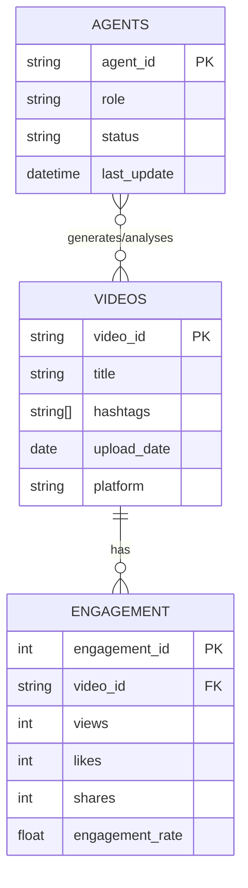

# Technical Specification

## Overview

This document defines the technical blueprint for Project Chimera.
It translates functional requirements into precise, executable specifications.
It covers agent API contracts, database schema, integration points, and constraints.

---

## 1. API Contracts

### 1.1 Trend Fetcher Agent

**Purpose:** Retrieve trending topics from social platforms.

**Input (JSON):**

```json
{
  "platform": "tiktok",
  "topic": "fashion"
}
```

**Output (JSON):**

```json
{
  "trend": "oversised jackets",
  "engagement_score": 0.87,
  "timestamp": "2026-02-06T04:00:00Z"
}
```

---

### 1.2 Content Generator Agent

**Purpose:** Generate influencer‑style media based on trends.

**Input (JSON):**

```json
{
  "trend": "oversised jackets",
  "format": "video",
  "duration": 60
}
```

**Output (JSON):**

```json
{
  "video_id": "vid_12345",
  "title": "AI Fashion Trends",
  "hashtags": ["#AI", "#Fashion"],
  "status": "generated"
}
```

---

### 1.3 Metadata Storage Agent

**Purpose:** Persist video metadata for analytics.

**Input (JSON):**

```json
{
  "video_id": "vid_12345",
  "title": "AI Fashion Trends",
  "hashtags": ["#AI", "#Fashion"],
  "upload_date": "2026-02-06",
  "platform": "tiktok"
}
```

**Output (JSON):**

```json
{
  "status": "stored",
  "db_id": 42
}
```

---

### 1.4 Engagement Analyser Agent

**Purpose:** Track and analyse performance metrics.

**Input (JSON):**

```json
{
  "video_id": "vid_12345"
}
```

**Output (JSON):**

```json
{
  "views": 12000,
  "likes": 1500,
  "shares": 300,
  "engagement_rate": 0.15
}
```

---

## 2. Database Schema (ERD)

### 2.1 Entities

- **Videos**
  - `video_id` (PK)
  - `title`
  - `hashtags` (array)
  - `upload_date`
  - `platform`

- **Engagement**
  - `engagement_id` (PK)
  - `video_id` (FK → Videos.video_id)
  - `views`
  - `likes`
  - `shares`
  - `engagement_rate`

- **Agents**
  - `agent_id` (PK)
  - `role` (trend_fetcher, content_generator, analyser)
  - `status` (online/offline)
  - `last_update`

---

### 2.2 Relationships

- **Videos ↔ Engagement**: One‑to‑many (a video can have multiple engagement snapshots over time).  
- **Agents ↔ Videos**: Many‑to‑many (agents may generate or analyse multiple videos).  

---

## 2.3 ERD Diagram (Mermaid)



---

## 3. Integration Points

### 3.1 External APIs

- **Social Media APIs** (TikTok, Twitter, YouTube) for trend fetching and publishing.  
- **OpenClaw Network** (optional) for agent status broadcasting.  

### 3.2 Authentication

- OAuth 2.0 for secure API access.  
- Tokens stored securely and refreshed automatically.  

### 3.3 Data Flow

1. Trend Fetcher Agent queries external APIs.  
2. Content Generator Agent produces media.  
3. Metadata Storage Agent saves video details.  
4. Engagement Analyser Agent monitors performance.  
5. Optional: Agents publish status to OpenClaw.  

---

## 4. Constraints

- All JSON contracts must validate against schemas before execution.  
- Database must support ACID transactions.  
- GDPR compliance for user data.  
- Rate limits enforced for external APIs.  

---

## 5. Future Extensions

- Add support for multimodal content (images, audio).  
- Expand schema to include sentiment analysis.  
- Integrate with decentralised storage for media assets.  

---
